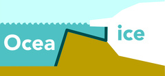

<a href="https://utrechtuniversity.github.io/transferice/"></a>
<!-- README.md is generated from README.Rmd. Please edit that file -->

```{r, include = FALSE}
knitr::opts_chunk$set(
  collapse = TRUE,
  comment = "#>",
  fig.path = "man/figures/README-",
  out.width = "100%"
)
```

```{r pkgs, echo=FALSE, message=FALSE, eval=FALSE}
# following code for loading and writing the bibtex references for the used pkgs
pkgs <- c("dplyr", "tibble", "stringr", "ggplot2", "rlang", "purrr", "devtools", 
          "roxygen2", "testthat", "knitr", "rmarkdown", "stars", "sf", 
          "thematic", "bslib", "shiny", "shinyWidgets", "shinycssloaders",
          "shinyjs")  
# Get the R reference
rref <- citation()
# Create ref key
rref$key <- "rversion"
hadley1 <- bibentry(
  key = "Wickham2015",
  bibtype = "Book",
  title = "R packages: organize, test, document, and share your code",
  author =  person("Hadley","Wickham"),
  year = "2015",
  publisher = " O'Reilly Media, Inc.",
  url = "https://r-pkgs.org/"
)
hadley2 <- bibentry(
  key = "Wickham2020",
  bibtype = "Book",
  title = "Mastering Shiny: Build Interactive Apps, Reports & Dashboards.",
  author =  person("Hadley","Wickham"),
  year = "2020",
  publisher = " O'Reilly Media, Inc.",
  url = "https://mastering-shiny.org/"
)
knitr::write_bib(pkgs, "vignettes/packages.bib", prefix = "")
pkgs <- bibtex::read.bib("vignettes/packages.bib")
bibtex::write.bib(
  purrr::reduce(list(rref, hadley1, hadley2, pkgs), append), 
  file = "vignettes/packages.bib"
)
```

# transferice

<!-- badges: start -->
[](https://www.repostatus.org/#concept)
[](https://choosealicense.com/licenses/mit/)
[)`-yellowgreen.svg)](/commits/master)
[](https://app.codecov.io/gh/UtrechtUniversity/transferice?branch=master)
<!-- badges: end -->

The goal of transferice is to reconstruct past oceanographic conditions using fossils. All steps of data selection, model construction, and final predictions are implemented in a `shiny`[@shiny] interface to provide a visual representation of the machine learning pipeline. 

{width=95%}

## Installation

You can install the development version of transferice from GitHub with devtools:

``` r
# Install tranferice from GitHub: 
# install.packages("devtools")
devtools::install_github("UtrechtUniversity/transferice")
```

## Funding

This project was funded by ERC Starting grant number 802835, OceaNice, awarded to Peter Bijl.

## Credits

The construction of the R [@rversion] package *transferice* and associated documentation was aided by the packages; *devtools* [@devtools], *roxygen2* [@roxygen2], *testthat* [@testthat], *knitr* [@knitr2014 ; @knitr2015], *rmarkdown* [@rmarkdown2018; @rmarkdown2020], and the superb guidance in the book: *R packages: organize, test, document, and share your code*, by @Wickham2015. 

Data transformation, cleaning and visualization is performed with: *dplyr* [@dplyr], *tibble* [@tibble], *stringr* [@stringr], and *rlang* [@rlang].

The app is build with *shiny* [@shiny] and the guidance in the book: *Mastering Shiny: Build Interactive Apps, Reports & Dashboards* [@Wickham2020] was a great help in learning how to develop such applications. Furthermore, the packages *shinyjs* [@shinyjs], *shinyWidgets* [@shinyWidgets],  *shinycssloaders* [@shinycssloaders], *bslib* [@bslib] and *thematic* [@thematic] ensure user friendliness and visually pleasing graphics.

## References