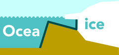

<a href="https://utrechtuniversity.github.io/transferice/"></a>
<!-- README.md is generated from README.Rmd. Please edit that file -->

# transferice

<!-- badges: start -->

[](https://www.repostatus.org/#concept)
[](https://choosealicense.com/licenses/mit/)
[](/commits/master)
[](https://app.codecov.io/gh/UtrechtUniversity/transferice?branch=master)
<!-- badges: end -->

The goal of transferice is to reconstruct past oceanographic conditions
using fossils. All steps of data selection, model construction, and
final predictions are implemented in a `shiny`(Chang et al. 2021)
interface to provide a visual representation of the machine learning
pipeline.

<figure>
<video src="man/figures/transferice-demo.ogv" style="width:95.0%"
controls=""><a href="man/figures/transferice-demo.ogv">Demo of the ocean
explorer</a></video>
<figcaption aria-hidden="true">Demo of the ocean explorer</figcaption>
</figure>

## Installation

You can install the development version of transferice from GitHub with
devtools:

``` r
# Install tranferice from GitHub: 
# install.packages("devtools")
devtools::install_github("UtrechtUniversity/transferice")
```

## Funding

This project was funded by ERC Starting grant number 802835, OceaNice,
awarded to Peter Bijl.

## Credits

The construction of the R (R Core Team 2022) package *transferice* and
associated documentation was aided by the packages; *devtools* (Wickham
et al. 2021), *roxygen2* (Wickham, Danenberg, et al. 2022), *testthat*
(Wickham 2022), *knitr* (Xie 2014 ; Xie 2015), *rmarkdown* (Xie,
Allaire, and Grolemund 2018; Xie, Dervieux, and Riederer 2020), and the
superb guidance in the book: *R packages: organize, test, document, and
share your code*, by Wickham (2015).

Data transformation, cleaning and visualization is performed with:
*dplyr* (Wickham, François, et al. 2022), *tibble* (Müller and Wickham
2022), *stringr* (Wickham 2019), and *rlang* (Henry and Wickham 2022).

The app is build with *shiny* (Chang et al. 2021) and the guidance in
the book: *Mastering Shiny: Build Interactive Apps, Reports &
Dashboards* (Wickham 2020) was a great help in learning how to develop
such applications. Furthermore, the packages *shinyjs* (Attali 2021),
*shinyWidgets* (Perrier, Meyer, and Granjon 2022), *shinycssloaders*
(Sali and Attali 2020), *bslib* (Sievert and Cheng 2021) and *thematic*
(Sievert, Schloerke, and Cheng 2021) ensure user friendliness and
visually pleasing graphics.

## References

<div id="refs" class="references csl-bib-body hanging-indent">

<div id="ref-shinyjs" class="csl-entry">

Attali, Dean. 2021. *Shinyjs: Easily Improve the User Experience of Your
Shiny Apps in Seconds*. <https://deanattali.com/shinyjs/>.

</div>

<div id="ref-shiny" class="csl-entry">

Chang, Winston, Joe Cheng, JJ Allaire, Carson Sievert, Barret Schloerke,
Yihui Xie, Jeff Allen, Jonathan McPherson, Alan Dipert, and Barbara
Borges. 2021. *Shiny: Web Application Framework for r*.
<https://shiny.rstudio.com/>.

</div>

<div id="ref-rlang" class="csl-entry">

Henry, Lionel, and Hadley Wickham. 2022. *Rlang: Functions for Base
Types and Core r and Tidyverse Features*.
<https://CRAN.R-project.org/package=rlang>.

</div>

<div id="ref-tibble" class="csl-entry">

Müller, Kirill, and Hadley Wickham. 2022. *Tibble: Simple Data Frames*.
<https://CRAN.R-project.org/package=tibble>.

</div>

<div id="ref-shinyWidgets" class="csl-entry">

Perrier, Victor, Fanny Meyer, and David Granjon. 2022. *shinyWidgets:
Custom Inputs Widgets for Shiny*.
<https://CRAN.R-project.org/package=shinyWidgets>.

</div>

<div id="ref-rversion" class="csl-entry">

R Core Team. 2022. *R: A Language and Environment for Statistical
Computing*. Vienna, Austria: R Foundation for Statistical Computing.
<https://www.R-project.org/>.

</div>

<div id="ref-shinycssloaders" class="csl-entry">

Sali, Andras, and Dean Attali. 2020. *Shinycssloaders: Add Loading
Animations to a Shiny Output While It’s Recalculating*.
<https://github.com/daattali/shinycssloaders>.

</div>

<div id="ref-bslib" class="csl-entry">

Sievert, Carson, and Joe Cheng. 2021. *Bslib: Custom Bootstrap ’Sass’
Themes for Shiny and Rmarkdown*.
<https://CRAN.R-project.org/package=bslib>.

</div>

<div id="ref-thematic" class="csl-entry">

Sievert, Carson, Barret Schloerke, and Joe Cheng. 2021. *Thematic:
Unified and Automatic Theming of Ggplot2, Lattice, and Base r Graphics*.
<https://CRAN.R-project.org/package=thematic>.

</div>

<div id="ref-Wickham2015" class="csl-entry">

Wickham, Hadley. 2015. *R Packages: Organize, Test, Document, and Share
Your Code*. O’Reilly Media, Inc. <https://r-pkgs.org/>.

</div>

<div id="ref-stringr" class="csl-entry">

———. 2019. *Stringr: Simple, Consistent Wrappers for Common String
Operations*. <https://CRAN.R-project.org/package=stringr>.

</div>

<div id="ref-Wickham2020" class="csl-entry">

———. 2020. *Mastering Shiny: Build Interactive Apps, Reports &
Dashboards.* O’Reilly Media, Inc. <https://mastering-shiny.org/>.

</div>

<div id="ref-testthat" class="csl-entry">

———. 2022. *Testthat: Unit Testing for r*.
<https://CRAN.R-project.org/package=testthat>.

</div>

<div id="ref-roxygen2" class="csl-entry">

Wickham, Hadley, Peter Danenberg, Gábor Csárdi, and Manuel Eugster.
2022. *Roxygen2: In-Line Documentation for r*.
<https://CRAN.R-project.org/package=roxygen2>.

</div>

<div id="ref-dplyr" class="csl-entry">

Wickham, Hadley, Romain François, Lionel Henry, and Kirill Müller. 2022.
*Dplyr: A Grammar of Data Manipulation*.
<https://CRAN.R-project.org/package=dplyr>.

</div>

<div id="ref-devtools" class="csl-entry">

Wickham, Hadley, Jim Hester, Winston Chang, and Jennifer Bryan. 2021.
*Devtools: Tools to Make Developing r Packages Easier*.
<https://CRAN.R-project.org/package=devtools>.

</div>

<div id="ref-knitr2014" class="csl-entry">

Xie, Yihui. 2014. “Knitr: A Comprehensive Tool for Reproducible Research
in R.” In *Implementing Reproducible Computational Research*, edited by
Victoria Stodden, Friedrich Leisch, and Roger D. Peng. Chapman;
Hall/CRC. <http://www.crcpress.com/product/isbn/9781466561595>.

</div>

<div id="ref-knitr2015" class="csl-entry">

———. 2015. *Dynamic Documents with R and Knitr*. 2nd ed. Boca Raton,
Florida: Chapman; Hall/CRC. <https://yihui.org/knitr/>.

</div>

<div id="ref-rmarkdown2018" class="csl-entry">

Xie, Yihui, J. J. Allaire, and Garrett Grolemund. 2018. *R Markdown: The
Definitive Guide*. Boca Raton, Florida: Chapman; Hall/CRC.
<https://bookdown.org/yihui/rmarkdown>.

</div>

<div id="ref-rmarkdown2020" class="csl-entry">

Xie, Yihui, Christophe Dervieux, and Emily Riederer. 2020. *R Markdown
Cookbook*. Boca Raton, Florida: Chapman; Hall/CRC.
<https://bookdown.org/yihui/rmarkdown-cookbook>.

</div>

</div>
